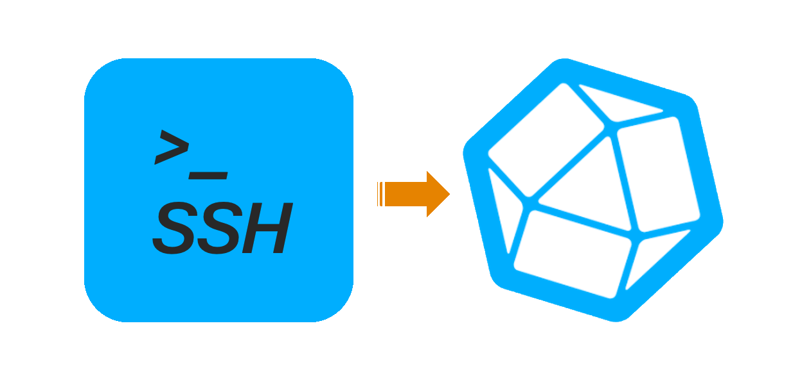

<a name="readme-top"></a>
[![Contributors][contributors-shield]][contributors-url]
[![Forks][forks-shield]][forks-url]
[![Stargazers][stars-shield]][stars-url]
[![Issues][issues-shield]][issues-url]
[![Cisco Sample Code License, Version 1.1][license-shield]][license-url]
[![LinkedIn][linkedin-shield]][linkedin-url]


<!-- PROJECT LOGO -->
<br />
<div align="center">
  <a href="https://github.com/jasoncdavis/SSH2Influx">
    
  </a>

<h3 align="center">SSH2Influx</h3>

  <p align="center">
    Convert CLI-based data from SSH-accessible endpoints into InfluxDB measurements for graphing and dashboards!
    <br />
    <a href="https://github.com/jasoncdavis/SSH2Influx/issues">Report Bug</a>
    ·
    <a href="https://github.com/jasoncdavis/SSH2Influx/issues">Request Feature</a>
  </p>
</div>

[](https://youtu.be/o_J-bQHChCQ "SSH2Influx - Background and Demo")


<!-- TABLE OF CONTENTS -->
<ol>Table of Contents
  <li>
    <a href="#about-the-project">About The Project</a>
    <ul>
      <li><a href="#built-with">Built With</a></li>
    </ul>
  </li>
  <li>
    <a href="#getting-started">Getting Started</a>
    <ul>
      <li><a href="#prerequisites">Prerequisites</a></li>
      <li><a href="#installation">Installation</a></li>
      <li><a href="#configuration">Configuration</a></li>
    </ul>
  </li>
  <li><a href="#usage">Usage</a></li>
  <li><a href="#roadmap">Roadmap</a></li>
  <li><a href="#contributing">Contributing</a></li>
  <li><a href="#license">License</a></li>
  <li><a href="#contact">Contact</a></li>
  <li><a href="#acknowledgments">Acknowledgments</a></li>
</ol>


<!-- ABOUT THE PROJECT -->
## About The Project

Have you ever needed to periodically extract data from a device using SSH, then put it into InfluxDB to create beautiful Grafana dashboards?

<div align="center">
  <a href="https://github.com/jasoncdavis/SSH2Influx">
    
  </a>
</div>

If so, this is the project for you!

Admittedly there are *much better* ways to programmatically extract data from networked devices - gRPC streaming telemetry, NETCONF RPCs, even SNMP!  However, sometimes there's a metric in a device that is only available through an SSH connection and some command execution.

This project enables you to define what networked devices should be accessed, what commands to execute (either as a group or individually), what regular expression (regex) patterns to use to capture the desired output AND how to define the Influx tagging and keying to make proper measurements that are injected into InfluxDB!  How cool is that!?

A "parameters" file defines the device list, commands, regex patterns and tagging/keying specifications.
An [optionsconfig.yaml](./optionsconfig.yaml) file defines the secret credentials that should be maintained separately.

You may have multiple parameters files and use them at different polling intervals to suite your needs.

This SSH2Influx project has been used for the last year at the CiscoLive NOC to collect CLI-based metrics from Wireless LAN Controllers (WLCs) and Catalyst 7/9k switches.  It has recently been enhanced to also support Linux end-points, such as Ubuntu VMs.

A sample of a CiscoLive NOC dashboard created with this project.

[![NOC Dashboard Screen Shot][product-screenshot]]

<p align="right">(<a href="#readme-top">back to top</a>)</p>


### Built With

* [![Python][python.org]][Python-url]
* [![InfluxDB][influxdb.org]][Influx-url]

<p align="right">(<a href="#readme-top">back to top</a>)</p>


<!-- GETTING STARTED -->
## Getting Started

To get started we need to prepare our execution environment, obtain the source code, then follow-up with a parameters file defining the job properties.

### Prerequisites

We need a Python 3.7+ environment.  A virtual environment is also suggested.
* Python

  This is a suggested resource to [install Python](https://www.python.org/downloads/)
  
* InfluxDB
  
  This is a suggested resource to [install InfluxDB](https://www.influxdata.com/products/influxdb/)

* Grafana

  This is a suggested resource to [install Grafana](https://grafana.com/grafana/download/10.0.0?pg=oss-graf&plcmt=hero-btn-1)

> **Note**
> We are focusing this project on the SSH collection, pattern matching and InfluxDB ingestion activities.  It is up to the user to define how they want to create and display their dashboards in Grafana


### Installation

1. Clone the repo
   ```sh
   git clone https://github.com/jasoncdavis/SSH2Influx.git
   ```
2. Create a Python virtual environment (venv)
   ```sh
   cd SSH2Influx
   python3 -m venv .venv
   source .venv/bin/activate
   ```
3. pip install the project requirements
   ```sh
   pip install -r requirements.txt
   ```

<p align="right">(<a href="#readme-top">back to top</a>)</p>


<!-- USAGE EXAMPLES -->
### Configuration

After installation we focus on setting up the necessary project files.  Two main files are necessary.
* *optionsconfig.yaml*
  
  This YAML formatted file contains device inventory, credentials and Influx server information (with credentials).  Keep access to this file restricted, as it contains credential information. An example is at [example-optionsconfig.yaml](./example-optionsconfig.yaml) - copy this file to optionsconfig.yaml, then edit it to reflect your InfluxDB server specifications and credentials.  Also add your inventory information. The DevNet Sandbox Always-On devices have been provided for getting started and familiarization with the project. You will eventually want to remove those 3 entries.

* *parameters.yaml*
  
  This file can be renamed to suite your preference as the filename is passed as a command-line argument to the execution of SSH2Python.py.  It is in YAML format and contains non-confidential information about the job inventory, which may be a smaller subset of the main inventory in [optionsconfig.yaml](./optionsconfig.yaml).  It also defines an optional Influx server reference, so different job specifications can have different target Influx servers for storage. The regular expression matching patterns and tagging criteria for [Influx line protocol](https://docs.influxdata.com/influxdb/v2.7/reference/syntax/line-protocol/) also goes in this file. Examples for this file are in [examples/](./examples/) 


### Influx Line Protocol

The project uses the Influx Line Protocol to inject the SSH/CLI metrics and properly formatted measurements for InfluxDB.

The InfluxDB Line Protocol is more completely documented [HERE](https://docs.influxdata.com/influxdb/v2.7/reference/syntax/line-protocol/)

Essentially the format appears as...

    // Syntax
    <measurement>[,<tag_key>=<tag_value>[,<tag_key>=<tag_value>]] <field_key>=<field_value>[,<field_key>=<field_value>] [<timestamp>]
    
    // Example
    myMeasurement,hostname=core-router,interface=GigabitEthernet0/0/1 errors=1234 1556813561098000000

To elaborate, you start with a defined measurement name, follow it with a comma, then one or more comma separated 'static' tags, then a space, then one or more comma separated 'variable' fields and keys.  Finally a space and a specified timestamp can be provided.  The timestamp is optional and can be assumed to be the current date/time (in UTC) when the measurement is injected to InfluxDB.  This project uses that assumption - it collects the data, formats it to line protocol and injects the measurements to InfluxDB with the current date/time stamp.  We pack multiple measurements from all devices and matching specifications provided in the parameters.yaml file into a single push to InfluxDB for each polling interval.

Each measurement entry is appended to a group of entries.  Each entry also has the *device* static tag provided which maps to the device the command was executed on.  Other static and variable tags are defined in the parameters.yaml file.

### Host Command execution

It is important to know the full commands desired for execution on the remote host.  Do not rely on CLI shortcuts or interpreted variables.  It is suggested to execute the command(s) on a representative device manually to verify the command syntax and collect sample output for the next step of Regular Expression pattern matching.

### Regular Expression (Regex) pattern matching

Once the command output is obtained the desired metrics must be defined through capture groups in regular expression (regex) pattern match statements. I find it convenient to use the [Patterns](https://krillapps.com/patterns/) app on MacOS platforms to build and visualize my regex patterns.  There are many similar tools available.  It is not suggested to use free online web site tools, especially if you're dealing with private information of serial numbers, contract data, etc.

### Creating the parameters file

The parameters file is in YAML format and can be filenamed to your preference.  The base schema is:

    inventory:
      credential_set: DefaultCredentials
      hosts:
        - host: host-a
        - host: host-with-specific-commands
          commands:
            - cmd: show 'something'
            - cmd: show 'somethingelse'
      groupcommands:
        - cmd: show <groupcommand>
          parsespec: 101

    parsespecs:
      - parsespec: 101
        measurement: inventory
        matchtype: single

*inventory* is one of two branches - it defines the credential set, host list and group commands for the job.  Credential sets are defined in the [optionsconfig.yaml](./optionsconfig.yaml) file with all credentials and API keys.  The credential set value, *DefaultCredentials* in this example, must be defined similar to this form:

    # Authentication Groups
    DefaultCredentials:
      username: myUserName
      password: myPassword

If a credential_set is not defined or if there is an overriding value in the [optionconfig.yaml](./optionsconfig.yaml) file, then the project will assume the host-specific defined credential in the [optionsconfig.yaml](./optionsconfig.yaml) host entry.

The *hosts* sub-branch defines all devices that are part of this job specification. Individual hosts can have host-specific commands added to their 'group commands', if defined in their subordinate record.

The *groupcommands* sub-branch defines all commands and parsing specifications that should be executed on every device in the hosts list.  The *parsespec* reference must map to a full parsespec record defined later in the parameters.yaml file.

*parsespecs* is the second of the main branches.  It defines the parsing specifications which include the *parsespec* cross-reference value, measurement name, matchtype, regex pattern(s) and tag/field values.

There are 3 supported modes of regex matchtypes.
* single
* multiple
* iterative

#### Single regex matchtypes

A single regex match type processes through the command output in one pass with one regex pattern that has or or more matching groups.  This is a common match type and is expected to be used most often.

An example of a single match type parameters YAML file can be found as [examples/sample-single.yaml](./examples/sample-single.yml)


#### Multiple regex matchtypes

A multiple regex match type processes through the command output in one pass, but assumes the same regex pattern match against multiple lines.  Therefore, multiple matches may be found and associated to the measurement group produced.  

Consider a command output that has multiple line outputs (or records) related to similar items, such as CPUs, interfaces, process lists, power supplies, etc.  A regex pattern could match against each item-record and extract the same capturing group(s) from each item-record or line.

An example of a multiple match type parameters YAML file can be found as [examples/sample-multiple.yaml](./examples/sample-multiple.yml)

#### Iterative regex matchtypes

An iterative regex match type processes through the command output in several passes.  It can apply the same regex pattern to multiple matched instances in the output and tag them with different field values.  Consider output where there are multiple records - eg. IPv4 and IPv6 or TCP and UDP.
The other usecase is where the same output must have multiple, different regex patterns applied.  Consider a command output that has multiple metrics of interest, but they must be obtained with different regex patterns.  The iterative match type will retain the whole output and apply each parsing spec regex pattern in a list of patterns. There could be still be several matching groups per regex pattern.  The resulting metrics would be combined into a single measurement, e.g. ipv4 and ipv6 stats.

An example of this can be found as [examples/sample-iterative.yaml](./examples/sample-iterative.yml)


<p align="right">(<a href="#readme-top">back to top</a>)</p>

## Usage

The SSH2Influx.py program has command-line help. To access, run the following.

```sh
   cd SSH2Influx
   source .venv/bin/activate
   python SSH2Influx -help
   ```

This results in useage help of...
```sh
   usage: SSH2Influx.py [-h] [-d] -p paramfile [-g group] [-f frequency]

   Obtain metrics from a device via SSH; parse and format for InfluxDB

   options:
     -h, --help            show this help message and exit
     -d, --debug           Enables debug with copious console output, but none to InfluxDB
     -p paramfile, --paramfile paramfile
                           YAML file with inventory and parsing specs
     -g group, --group group
                           Device group from optionsconfig.yaml (default of "device_inventory")
     -f frequency, --frequency frequency
                           Frequency (in seconds) to repeat collection (default of 300 seconds)
```

Debug mode (-p or --debug) is optional.
Providing the parameter file is required.
Providing the polling frequency is optional, but defaults to every 5 minutes.

An example of usage with the provided [examples/sample-single.yaml](./examples/sample-single.yml) parameters file follows.

```sh
(.venv) jason@macbook SSH2Influx % python SSH2Influx.py -p examples/sample-single.yml
Starting script SSH2Influx.py with parameters file "examples/sample-single.yml" at 2023-07-07 16:01:32.782917 with DEBUG False
Using project-wide Influx server: influxdb

=====Learning device prompts
sandbox-iosxe-latest-1 initialized
sandbox-iosxe-recomm-1 initialized
sandbox-iosxr-1 initialized

=====Collecting commands for hosts...
Connection made to sandbox-iosxe-latest-1 / 131.226.217.143:22 with prompt <Cat8000V#>
Connection made to sandbox-iosxe-recomm-1 / 131.226.217.149:22 with prompt <csr1000v-1#>
Connection made to sandbox-iosxr-1 / 131.226.217.150:22 with prompt <RP/0/RP0/CPU0:HelloSweetWorld#>


=====Processing output of hosts...
Processing: sandbox-iosxe-latest-1
Processing: sandbox-iosxe-recomm-1
Processing: sandbox-iosxr-1

COMPLETE with command processing - Final influx write line output is:
inventory,device=sandbox-iosxe-latest-1,hostname=Cat8000V uptime="1 hour, 4 minutes"
inventory,device=sandbox-iosxe-recomm-1,hostname=csr1000v-1 uptime="1 day, 5 hours, 8 minutes"
inventory,device=sandbox-iosxr-1,hostname=System uptime="4 days 1 hour 5 minutes"

204 - No Content -
Good data push to InfluxDB

Finished at: Fri Jul  7 16:01:40 2023
Execution time in seconds: 4.138

Waiting 300 seconds until next poll.
```

Use CONTROL-C to break the execution, if you wish to stop the periodic polling.

<!-- ROADMAP -->
## Roadmap

- [ ] Allow the use of SSH keys
- [ ] Enhanced Threading for larger environments
- [ ] Feature 3
    - [ ] Nested Feature

See the [open issues](https://github.com/jasoncdavis/SSH2Influx/issues) for a full list of proposed features (and known issues).

<p align="right">(<a href="#readme-top">back to top</a>)</p>


<!-- CONTRIBUTING -->
## Contributing

Contributions are what make the open source community such an amazing place to learn, inspire, and create. Any contributions you make are **greatly appreciated**.

If you have a suggestion that would make this better, please fork the repo and create a pull request. You can also simply open an issue with the tag "enhancement".
Don't forget to give the project a star! Thanks again!

1. Fork the Project
2. Create your Feature Branch (`git checkout -b feature/AmazingFeature`)
3. Commit your Changes (`git commit -m 'Add some AmazingFeature'`)
4. Push to the Branch (`git push origin feature/AmazingFeature`)
5. Open a Pull Request

<p align="right">(<a href="#readme-top">back to top</a>)</p>


<!-- LICENSE -->
## License

Distributed under the Cisco Sample Code License, Version 1.1 License. See [LICENSE.md](./LICENSE.md) for more information.

<p align="right">(<a href="#readme-top">back to top</a>)</p>


<!-- CONTACT -->
## Contact

[@SNMPguy](https://twitter.com/SNMPguy) - jadavis@cisco.com

[https://github.com/jasoncdavis/SSH2Influx](https://github.com/jasoncdavis/SSH2Influx)

<p align="right">(<a href="#readme-top">back to top</a>)</p>


<!-- ACKNOWLEDGMENTS -->
## Acknowledgments

* [Mel Delgado](https://developer.cisco.com/people/mel-delgado/)

<p align="right">(<a href="#readme-top">back to top</a>)</p>


[](https://developer.cisco.com/codeexchange/github/repo/jasoncdavis/SSH2Influx)


<!-- MARKDOWN LINKS & IMAGES -->
<!-- https://www.markdownguide.org/basic-syntax/#reference-style-links -->
[contributors-shield]: https://img.shields.io/github/contributors/jasoncdavis/SSH2Influx.svg?style=for-the-badge
[contributors-url]: https://github.com/jasoncdavis/SSH2Influx/graphs/contributors
[forks-shield]: https://img.shields.io/github/forks/jasoncdavis/SSH2Influx.svg?style=for-the-badge
[forks-url]: https://github.com/jasoncdavis/SSH2Influx/network/members
[stars-shield]: https://img.shields.io/github/stars/jasoncdavis/SSH2Influx.svg?style=for-the-badge
[stars-url]: https://github.com/jasoncdavis/SSH2Influx/stargazers
[issues-shield]: https://img.shields.io/github/issues/jasoncdavis/SSH2Influx.svg?style=for-the-badge
[issues-url]: https://github.com/jasoncdavis/SSH2Influx/issues
[license-shield]: https://img.shields.io/badge/License-Cisco%20Sample%20Code%20License%2C%20Version%201.1-lime
[license-url]: https://developer.cisco.com/site/license/cisco-sample-code-license
[linkedin-shield]: https://img.shields.io/badge/-LinkedIn-black.svg?style=for-the-badge&logo=linkedin&colorB=555
[linkedin-url]: https://linkedin.com/in/jasoncdavis
[product-screenshot]: images/screenshot.jpg

[python.org]: https://img.shields.io/badge/python-3670A0?style=for-the-badge&logo=python&logoColor=ffdd54
[Python-url]: https://python.org/
[influxdb.org]: https://img.shields.io/badge/InfluxDB-22ADF6?style=for-the-badge&logo=InfluxDB&logoColor=white
[Influx-url]: https://www.influxdata.com/products/influxdb-overview/